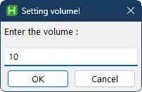

# Windows Sound Setter 🔊

 <br/><br/><br/><br/><br/><br/>

---

I'm tired of moving my cursor to the bottom right of monitor to set the volume, so I created this small those that I can control it by key presses.

> [!IMPORTANT]
> AutoHotKey has to be installed in computer!
> 
> you can install it using `winget`:
>
> ```powershell
> winget install --id Lexikos.AutoHotkey
> ```

### Start Using

You can run the following command in **powershell** and it will download the `ahk` script into startup folder of current user:

```powershell
$path = "$env:USERPROFILE\AppData\Roaming\Microsoft\Windows\Start Menu\Programs\Startup\volume-ctrl.ahk"; iwr "https://github.com/samithseu/win-set-sound/raw/main/set-sound.ahk" -OutFile $path; Invoke-Item $path
```

### Stop Using

If you want to remove it, run the following command in **powershell** to delete:

```powershell
rm -Force "$env:USERPROFILE\AppData\Roaming\Microsoft\Windows\Start Menu\Programs\Startup\volume-ctrl.ahk"
```

### Controls

- Pressing `F8` to show the GUI. If you manually input the volume over `26`, it will ask you first
- Pressing `Alt + NumpadPlus` to volumn up by 2%
- Pressing `Alt + NumpadSub` to volumn down by 2%

You can customize `keys` to your liking by editing the script.
